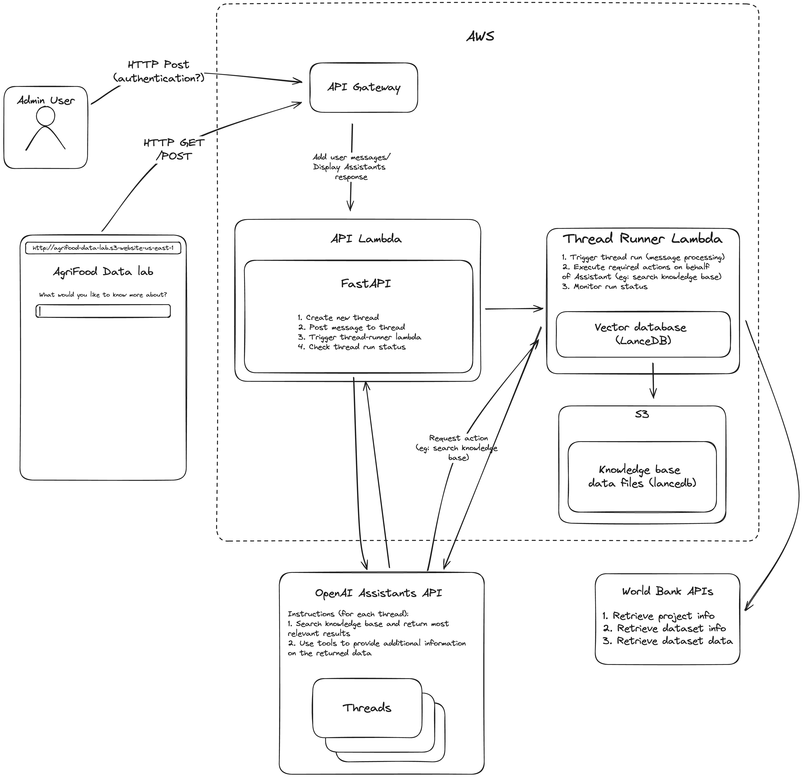

# World Bank Agrifood API

## Intro:
The World Bank Agrifoods API is a simple AWS backend that provides an interface to an [OpenAI Assistant](https://platform.openai.com/docs/assistants/overview?context=with-streaming), which helps WorldBank TTLs search for and interact with various types of data relevant to agrifood related projects.



## Installation

Uses [poetry](https://python-poetry.org/) for dependency management

```bash
pip install --upgrade poetry
poetry install
```

Note: poetry will install libraries and run commands in a virtualenv if none are activated, however you can create your own virtualenv in order to run commands without `poetry run:
```bash
python -m pip install virtualenv
python -m virtualenv ENV_NAME
source ENV_NAME/bin/activate
poetry install
```

## Environment variables:

Copy `.env.example` to `.env`. Set the following environment values:

```bash
STAGE="dev|staging|prod"  # use to set different backend environments
OWNER="your_name" # tag resources with your name
OPENAI_ASSISTANT_NAME="wb-agrifood-datalab" # used to identify the assisant in the OpenAI backend
OPENAI_API_KEY="" # used both when generating embeddings and for the API to communicate with the OpenAI backend
OPENAI_EMBEDDING_MODEL="text-embedding-3-small" # model to use to create embeddings both for data indexed in the knowledge base and for user queries
LANCEDB_DATA_PATH="app_data/lancedb" # path in S3 under which knowledge base should store data files
FRONTEND_DOMAIN="" # Add a CORS exception
FORCE_RECREATE=True # Boolean - wether or not to delete and re-create assistant
YOUTUBE_DATA_API_KEY="" # Only needed if retrieving video segment titles for the knowledge base (see https://developers.google.com/youtube/v3/docs for youtube API reference)
```

## Running locally:
Coming soon!

[//]: # "Running with Uvicorn? (uvicorn main:app --reload)"

## Deploying:
The following CI/CD scheme has been implemented:
- merge/push to `develop` --> deploy to `dev` environment
- merge/push to `main` --> deploy to `staging` environment
- release tagged on `main` (eg: `v1.0.0`) --> deploy to `prod` environment (TODO)

Alternatively the stack can be manually deployed with [AWS CDK](https://aws.amazon.com/cdk/), for any deployment that should bypass the above CI/CD procedures (eg: manually deploying a new feature for testing, that may interfere with other features currently being tested):
```bash
nvm use 18
npm install -g aws-cdk@2.X

poetry run cdk deploy

# specify an env file other than `.env`:
ENV_FILE=.env.dev poetry run cdk deploy
```


(Note: the `poetry run` portion of the command can be skipped if the libraries were all installed using poetry from a python virtual environmnet)

The `cdk deploy` output will contain the API Gateway instance's endpoint URL.

For convenience, we have collected the staging and dev API endpoints under the following Cloudfront distribution:
```bash
d1uptve87met4x.cloudfront.net/api/dev
d1uptve87met4x.cloudfront.net/api/staging
```
(note the base URL of the Cloudfront distribution points to the staging frontend: d1uptve87met4x.cloudfront.net)

CDK does not allow for modifying the attributes of an existing resource, so it's not possible to have the CDK deployment automatically update the behaviours of the Cloudfront distribution, which means they have to be manually updated (if the API Gateway endpoint URL changes, for example):
1. Under `Origins` add the API Gateway instance with a descriptive name (eg: `dev-api`)
2. Under `Behaviors` > `Create Behavior` find the origin from step 1 and specify the path pattern that the behaviour should match (eg: `/api/dev*`)

Note: the path pattern should match the value of the `STAGE` env variable that was used whe deploying the API, since the FastAPI application is instaniated with this base pase

#### Possible improvements:
- A custom CDK resource that triggers a lambda function to update the bahaviours of the imported Cloudfront instance whenever the API Gateway is updated
- Create a separate "base" CDK stack which contains the cloudfront distribution and imports the output URLs from all the different API CDK stacks

## Updating the OpenAI assistant:
The OpenAI assistant is defined in the `src/utils/update_openai_assistant.py` file. If any modifications are made to the Assistant's configuration, it can be re-deployed with:
```bash
poetry run python src/utils/update_openai_assistant.py # (omit `poetry run` if using a virutalenv)
```

Make sure the `FORCE_RECREATE` flag/environment variable is set to true to ensure the Assistant is deleted and re-created.

The Github CI/CD is configured to recreate the OpenAI assistant (`dev` on pushed to `branch:develop`, `staging` on pushes to `branch:main` and `prod` on release tags from `branch:main`)

#### Note: after updating the Assistant, be sure to re-run the deployment for the corresponding stack, so that the stack is aware of the new Assistant's ID (this is what the API uses to find the correct Assistant to interact with)

## Updating the knowledge base:
The knowledge base uses [LanceDB](https://lancedb.github.io/lancedb/), a very effcicient, in-memory vector database, with metadata filtering. The database is instantiated from data files in S3, so the database can be eaily updated by anyone who has access to the S3 bucket. Once the data files in S3 are updates, the changes will be immediately available in the API (without having to manage an external database infrastructure/migration logic).

The knowledge base can be updated with the `src/utils/update_vector_database.py` script. The vector database is also scoped to a specific backend environement (`dev`, `staging`, `prod`, etc) so make sure that the `STAGE` environment variable points to the correct backend for which you want to update the vector database:
```bash
poetry run python src/utils/update_vector_database.py`
```
(Again, you can omit the `poetry run` if running the above command in a virtual environment)

As with the OpenAI Assistant, the Github CI/CD is configured to destroy and re-create the knowledge base (`dev` on pushed to `branch:develop`, `staging` on pushes to `branch:main` and `prod` on release tags from `branch:main`)


The script expects all of the knowledge based records to be stored in a JSON file (`records.json`), as a List of JSON objects, each with at least the following keys: `id: str, title: str, type: str` and any number of other metadata key-value pairs (see [here](https://lancedb.github.io/lancedb/sql/) for the filtering options available for metadata fields).

Currently, due to the very low number of data entries in the knowledge base we aren't using any [ANN indexes](https://lancedb.github.io/lancedb/ann_indexes/). Without an ANN index, the query runtime will grow proportionally to the database size. After a certain point it will be necessary to [train an index](https://lancedb.github.io/lancedb/ann_indexes/). Eventually, at an even larger data volume, it may be a good idea to switch to a dedicated database, such as Postgres.

#### Possible improvements to make the vector database more "user-friendly" to update:
- Add an optional flag to add to, rather than overwite the database in the `vector_database.py` script
- Include updating the vector in the github CI/CD (this would require uploading the `records.json` file to Github, which is not a great idea, given how big the file can be with all the embeddings can be, it would have to pull it in from a share location, such as S3, but then we're back to square one with the AWS access credentials issue)
- Add an endpoint to the API which allows for inserting data into the database (this is very easy to implement but does require some dedicated logic for validating data being added to the database, and introduces a completely un-authenticated access to the datbaase, which might not be the best idea)

## API Docs

The API docs are available at API_ENDPOINT/docs.

Eg: https://d1uptve87met4x.cloudfront.net/api/dev/docs
